# 第2课 按键切换与自动轮播

---

## 本课对应赛题说明

**本节课在整个赛题中的位置：基础要求②的完善与优化**

| 赛题要求 | 类型 | 本节课覆盖程度 |
|---|---|---|
| 基础要求①：TF卡BMP读取+SDRAM帧缓存+HDMI显示 | 基础 | ✅ 官方例程已实现，本节课不改动 |
| 基础要求②：按键手动切换+自动轮播模式 | 基础 | ✅ 本节课核心：在官方已有基础上优化交互体验 |
| 基础要求③：HDMI音频输出+音视频同步 | 基础 | ✅ 官方例程已实现，本节课不改动 |
| 基础要求④：Flash固化+上电自启动+系统稳定 | 基础 | ⚠️ 本节课不涉及，第4课详细讲 |
| 扩展要求1~5 | 扩展 | ❌ 本节课不涉及 |

**本节课的定位：**

- 这是第一节"动手改代码"的课，只改`sd_card_bmp.v`一个文件
- 官方例程已经实现了基础要求②的核心功能（下一张+自动轮播），本节课做三个优化：加上一张、轮播周期可配置、数码管显示图片编号
- 所有改动都在应用层，不碰SDRAM、HDMI等底层驱动，风险极低
- 学完这节课，你会掌握在官方例程上做最小改动的方法，理解状态机扩展、参数化设计、按键长按检测的实现思路

**学完本节课你将掌握：**

1. `sd_card_bmp.v`的完整代码结构和核心状态机流程
2. 按键消抖模块`key_press_debounce`的工作原理
3. 双缓冲原子提交和防连跳机制的代码实现
4. 三个优化功能的实现思路和具体代码修改点
5. 从官方简易控制到完赛工程完整控制架构的演进思路
6. 应用层最小改动的设计原则和验证方法

---

## 一、官方例程 sd_card_bmp.v 深度拆解

`sd_card_bmp.v`是整个系统的"大脑"，也是我们这节课唯一要修改的文件。官方例程中这个文件有350行代码，包含了图片扫描、加载、切换、自动轮播、双缓冲控制、按键消抖等全部应用层逻辑。

### 1.1 模块接口

```verilog
module sd_card_bmp #(
    parameter integer CLK_FREQ_HZ       = 100_000_000,  // 时钟频率100MHz
    parameter [31:0]  SCAN_START_SECTOR = 32'd0,          // 扫描起始扇区
    parameter [31:0]  SCAN_MAX_SECTOR   = 32'd131071,     // 扫描最大扇区
    parameter [2:0]   SCAN_TARGET_COUNT = 3'd4             // 扫描目标图片数量=4
)(
    input                       clk,                // 系统时钟100MHz
    input                       rst,                // 复位，高有效
    input                       key_next,           // KEY1按键输入（下一张）
    input                       key_auto,           // KEY2按键输入（自动轮播开关）
    output [3:0]                state_code,         // 状态码输出（给数码管）
    input  [15:0]               bmp_width,          // BMP图片宽度
    input  [15:0]               bmp_height,         // BMP图片高度
    output reg                  display_valid,      // 显示有效标志（首图提交前为0）

    input                       write_finish_toggle, // SDRAM写完成信号（电平翻转，来自mem_clk域）
    output reg [1:0]            write_buf_idx,      // 写缓冲区编号（0或1）
    output reg [1:0]            disp_buf_idx,       // 显示缓冲区编号（0或1）

    output                      write_req,           // 写请求
    input                       write_req_ack,       // 写请求应答
    output                      write_en,            // 写使能
    output [31:0]               write_data,          // 写数据（RGB+8bit填充）
    output                      SD_nCS,              // SD卡片选
    output                      SD_DCLK,             // SD卡时钟
    output                      SD_MOSI,             // SD卡主出从入
    input                       SD_MISO              // SD卡主入从出
);
```

**接口解读：**
- 4个parameter：时钟频率、扫描范围、目标图片数量，都是可配置的
- 输入：时钟、复位、两个按键、BMP尺寸、写完成信号
- 输出：状态码、显示有效、双缓冲索引、写控制信号、SD卡SPI接口
- 注意：`write_finish_toggle`是从SDRAM时钟域（mem_clk）同步过来的电平翻转信号，不是单拍脉冲

**图2-1a 输入信号链路（外部→子模块→核心控制）：**

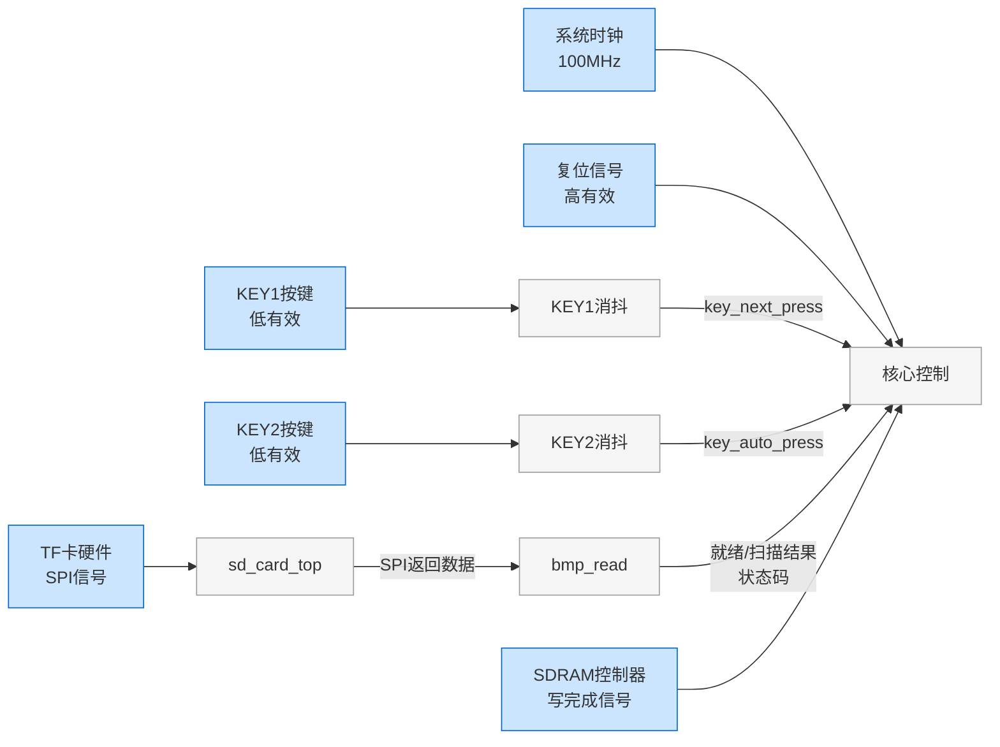

> **图注**：输入侧共4类接口——时钟/复位（蓝）、按键（蓝→消抖灰）、TF卡（蓝→协议层灰→解析层灰）、SDRAM反馈（蓝）。关键信号：key_next_press、key_auto_press、bmp_ready、scan_done、write_finish_toggle。结论：所有外部输入经消抖/协议转换后汇入核心控制状态机。

**图2-1b 输出信号链路（核心控制→子模块→外部）：**

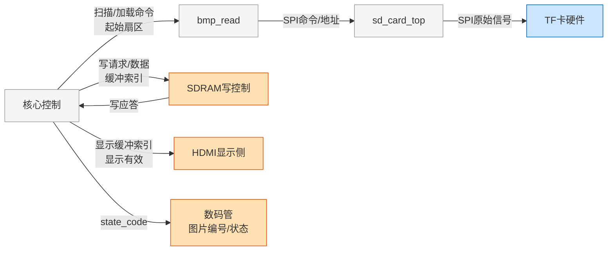

> **图注**：输出侧分3类——TF卡写命令（灰→蓝）、SDRAM写（橙）、显示输出（橙）。关键信号：scan_start、load_start、load_sector、write_req、write_buf_idx、disp_buf_idx、display_valid、state_code（第2课改为显示图片编号）。结论：核心控制状态机统一调度存储写入和显示输出。

**6类端口速查：**

| 类别 | 端口 | 方向 | 来自/送到 |
|---|---|---|---|
| ①系统信号 | clk, rst | 输入 | 顶层PLL/复位电路 |
| ②按键输入 | key_next, key_auto | 输入 | 开发板KEY1/KEY2（低有效） |
| ③BMP信息 | bmp_width, bmp_height | 输入 | 内部bmp_read模块 |
| ③BMP信息 | state_code | 输出 | 数码管（官方透传bmp_read状态码，第2课改为显示图片编号） |
| ④显示控制 | display_valid | 输出 | HDMI显示侧（首图提交前为0） |
| ④显示控制 | write_finish_toggle | 输入 | SDRAM控制器（电平翻转，mem_clk域） |
| ④显示控制 | write_buf_idx, disp_buf_idx | 输出 | SDRAM写侧/显示侧 |
| ⑤写控制 | write_req, write_en, write_data | 输出 | SDRAM控制器写端口 |
| ⑤写控制 | write_req_ack | 输入 | SDRAM控制器应答 |
| ⑥SD卡SPI | SD_nCS, SD_DCLK, SD_MOSI | 输出 | TF卡硬件 |
| ⑥SD卡SPI | SD_MISO | 输入 | TF卡硬件 |

### 1.2 内部子模块实例化

`sd_card_bmp`内部实例化了**4个子模块实例**（2个消抖+1个BMP读取+1个SD卡协议）：

**图2-2a 内部子模块层次结构：**

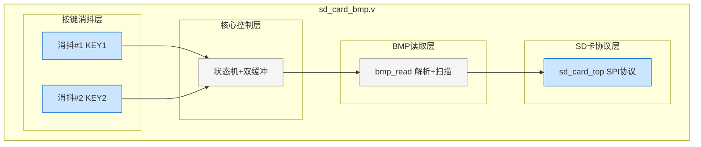

> **图注**：sd_card_bmp.v内部4层——核心控制（灰）、按键消抖（蓝）、BMP读取（灰）、SD卡协议（蓝）。关键：消抖和SD卡协议是"接口转换层"（蓝），核心控制和BMP解析是"业务逻辑层"（灰）。结论：all-in-one设计，所有功能挤在一个模块里。

**图2-2b 核心控制信号流向：**

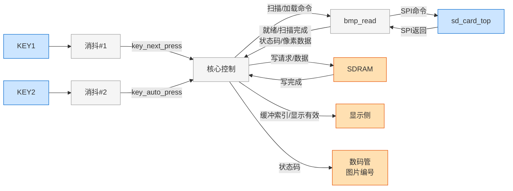

> **图注**：完整信号流——按键（蓝）→消抖（灰）→核心控制（灰）→BMP读取（灰）↔SD卡协议（蓝）；核心控制→SDRAM写（橙）→显示输出（橙）。关键信号：key_next_press、key_auto_press、scan_start、load_start、bmp_ready、scan_done、write_req、write_finish_toggle、disp_buf_idx。结论：核心控制状态机是所有信号的交汇点。


**4个子模块的分工：**

| 子模块 | 数量 | 功能 | 本节课是否修改 |
|---|---|---|---|
| key_press_debounce | 2个 | 按键消抖（20ms），输出按下沿单拍脉冲 | ✅ 修改KEY2的，增加button_stable_out端口 |
| bmp_read | 1个 | BMP文件解析+TF卡扇区扫描，内部有完整状态机 | ❌ 不改 |
| sd_card_top | 1个 | SD卡SPI协议时序生成，跟TF卡硬件直接通信 | ❌ 不改 |

> 注意：KEY1的消抖模块不用改，只改KEY2的——因为只有KEY2需要长按检测（需要消抖后的稳定状态button_stable），KEY1只有短按功能（只需要press_pulse脉冲）。

#### 按键消抖模块 key_press_debounce

```verilog
module key_press_debounce #(
    parameter integer CLK_FREQ_HZ = 100_000_000,
    parameter integer DEBOUNCE_MS = 20          // 消抖时间20ms
)(
    input  wire clk,
    input  wire rst,
    input  wire button_in,    // 默认：松开=1，按下=0（低有效）
    output reg  press_pulse   // 按下时输出一个单拍脉冲
);
```

**工作原理：**
1. 两级同步：`button_sync0` ← `button_in`，`button_sync1` ← `button_sync0`（防止亚稳态）
2. 消抖计数：当`button_sync1 != button_stable`时，计数器累加；当计数达到`DEBOUNCE_CYCLES`（20ms对应的时钟周期数）时，更新`button_stable`
3. 按下沿检测：当`button_stable=1`（松开）且`button_sync1=0`（按下）且消抖完成时，输出一个单拍`press_pulse`
4. 注意：是**按下沿**触发，不是松开沿触发

**详细工作流程（核心逻辑在always块里）：**

消抖模块内部有4个关键寄存器：

| 寄存器 | 位宽 | 功能 |
|---|---|---|
| `button_sync0` | 1bit | 第一级同步寄存器 |
| `button_sync1` | 1bit | 第二级同步寄存器 |
| `button_stable` | 1bit | 消抖后的稳定按键状态 |
| `cnt` | 32bit | 消抖计数器 |

**第一步，同步：** 每个时钟上升沿，`button_sync0 <= button_in`，然后`button_sync1 <= button_sync0`。这样经过两级触发器，异步的按键输入就同步到时钟域了，防止亚稳态。

**第二步，消抖计数：**

- 如果`button_sync1 == button_stable`，说明输入和稳定状态一样，没有变化，计数器清零。
- 如果不一样，说明输入变化了，开始计数。计数到`DEBOUNCE_CYCLES - 1`（也就是20毫秒）之后，说明输入已经稳定了20毫秒，这时候更新`button_stable <= button_sync1`，计数器清零。

**第三步，按下沿检测：** 在更新`button_stable`的同时，如果原来的`button_stable`是1（松开），新的`button_sync1`是0（按下），说明是一个"按下沿"，这时候输出一个单拍`press_pulse = 1`。

注意啊，是**按下沿触发**，不是松开沿触发。也就是说，你按下按键的那一刻（消抖确认之后），就输出一个脉冲，不用等松开。

整个消抖模块的工作原理就是这样：**两级同步防亚稳态 → 20毫秒计数消抖 → 按下沿检测输出单拍脉冲**。

这个设计非常标准，工业界都是这么做的。咱们这节课要加长按功能，其实就是在这个消抖的基础上，再加一个"按住持续计时"的逻辑——如果`button_stable`一直是0（一直按住），就持续累加一个长按计数器，计数到1秒就触发长按事件。

**关键参数计算：**
```
DEBOUNCE_CYCLES = (CLK_FREQ_HZ / 1000) * DEBOUNCE_MS
               = (100_000_000 / 1000) * 20
               = 2_000_000 个时钟周期
```

### 1.3 核心寄存器清单

官方例程有大约17个核心寄存器，按功能可以分成**5大类**。先看分类关系图，再逐个看详细表格：

**图2-3 寄存器分类关系图：**

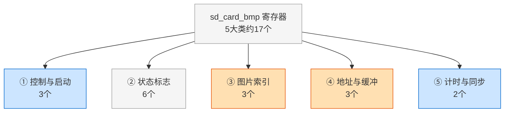

> **图注**：sd_card_bmp约17个寄存器分5类——控制启动（蓝：scan_start_pulse、load_start_pulse、scan_kicked）、状态标志（灰：first_image_committed、auto_play_en、next_req_pending、load_busy、source_done_seen、display_valid）、图片索引（橙：img_idx、load_idx、img_found_count）、地址缓冲（橙：load_sector、img_sector0~3、pending_buf_idx）、计时同步（蓝：auto_cnt、wrfin_tgl_sync）。结论：修改功能时先定位寄存器类别，避免盲目改代码。

> 上图是分类概览，每个分类下的具体寄存器见下方速查表和详细清单。

**5大类速查：**

| 类别 | 数量 | 核心作用 | 关键寄存器 |
|---|---|---|---|
| ①控制与启动 | 3 | 单拍脉冲启动扫描/加载+防重复扫描 | scan_start_pulse, load_start_pulse, scan_kicked |
| ②状态标志 | 6 | 首图提交/轮播开关/防连跳/忙标志/源数据完成/显示有效 | first_image_committed, auto_play_en, next_req_pending, load_busy, source_done_seen, display_valid |
| ③图片索引 | 3 | 已找到数量/当前显示/当前加载 | img_found_count, img_idx, load_idx |
| ④地址与缓冲 | 3 | 加载扇区/4张BMP扇区表/写入缓冲区 | load_sector, img_sector0~3, pending_buf_idx |
| ⑤计时与同步 | 2 | 轮播计时+跨时钟域同步 | auto_cnt, wrfin_tgl_sync |

**详细寄存器清单（按功能分组）：**

官方例程 `sd_card_bmp` 核心控制逻辑约 17 个寄存器，按功能分为 5 大类。理解每组的作用是读懂状态机的关键。

**① 控制与启动（3个）**

| 寄存器名 | 位宽 | 复位值 | 说明 |
|---|---|---|---|
| `scan_start_pulse` | 1bit | 0 | 扫描启动脉冲（单拍），启动 bmp_read 扫描前4张BMP |
| `load_start_pulse` | 1bit | 0 | 加载启动脉冲（单拍），启动 bmp_read 加载指定扇区的BMP |
| `scan_kicked` | 1bit | 0 | 扫描已启动标志，防止复位后重复发起扫描 |

**② 状态标志（6个）**

| 寄存器名 | 位宽 | 复位值 | 说明 |
|---|---|---|---|
| `first_image_committed` | 1bit | 0 | 首图已提交标志，首图加载完成并原子提交后为1 |
| `auto_play_en` | 1bit | 0 | 自动轮播使能，KEY2短按切换 |
| `next_req_pending` | 1bit | 0 | 下一张请求挂起标志，加载忙时只记1次，防连跳 |
| `load_busy` | 1bit | 0 | 加载忙标志，正在加载图片时为1 |
| `source_done_seen` | 1bit | 0 | 源数据送完标志，BMP数据已全部送进写FIFO |
| `display_valid` | 1bit | 0 | 显示有效标志，首图提交前为0（画面黑屏） |

**③ 图片索引（3个）**

| 寄存器名 | 位宽 | 复位值 | 说明 |
|---|---|---|---|
| `img_found_count` | 3bit | 0 | 已找到的BMP图片数量（0~4） |
| `img_idx` | 2bit | 0 | 当前**显示中**的图片编号（0~3） |
| `load_idx` | 2bit | 0 | 当前**正在加载**的图片编号 |

**④ 地址与缓冲（3个）**

| 寄存器名 | 位宽 | 复位值 | 说明 |
|---|---|---|---|
| `load_sector` | 32bit | 0 | 当前加载的BMP起始扇区地址 |
| `img_sector0~3` | 32bit×4 | 0 | 4张BMP的起始扇区地址（扫描阶段记录） |
| `pending_buf_idx` | 2bit | 0 | 当前正在写入的目标缓冲区编号（双缓冲之一） |

**⑤ 计时与同步（2个）**

| 寄存器名 | 位宽 | 复位值 | 说明 |
|---|---|---|---|
| `auto_cnt` | 32bit | 0 | 自动轮播计数器，计数到1秒产生 auto_tick |
| `wrfin_tgl_sync` | 3bit | 0 | 写完成信号同步寄存器（三级移位寄存器，跨时钟域同步） |

**关键区分：**

- `img_idx` = 当前显示的图片编号
- `load_idx` = 当前正在加载的图片编号
- `disp_buf_idx` = 当前显示用的缓冲区编号
- `write_buf_idx` = 当前写入用的缓冲区编号
- 这四个寄存器是分开的，不要混淆

### 1.4 三个关键函数

官方例程用了三个function来做组合逻辑计算，这是很好的设计风格——把纯组合逻辑封装成函数，主always块里只做时序逻辑。

#### 函数1：next_index_limited — 计算下一张图片编号

```verilog
function [1:0] next_index_limited;
    input [1:0] cur;      // 当前图片编号
    input [2:0] count;    // 已找到的图片总数
    begin
        case (count)
            3'd0: next_index_limited = 2'd0;                    // 0张图：固定0
            3'd1: next_index_limited = 2'd0;                    // 1张图：固定0
            3'd2: next_index_limited = (cur == 2'd1) ? 2'd0 : (cur + 2'd1);  // 2张图：0↔1
            3'd3: next_index_limited = (cur == 2'd2) ? 2'd0 : (cur + 2'd1);  // 3张图：0→1→2→0
            default: next_index_limited = (cur == 2'd3) ? 2'd0 : (cur + 2'd1); // 4张图：0→1→2→3→0
        endcase
    end
endfunction
```

**设计思路：** 根据实际找到的图片数量来循环，不会切到不存在的图片。比如只有2张图，就只会在0和1之间循环，不会切到2或3。

#### 函数2：sector_lut — 根据图片编号查扇区地址

```verilog
function [31:0] sector_lut;
    input [1:0] idx;
    begin
        case (idx)
            2'd0: sector_lut = img_sector0;
            2'd1: sector_lut = img_sector1;
            2'd2: sector_lut = img_sector2;
            2'd3: sector_lut = img_sector3;
            default: sector_lut = img_sector0;
        endcase
    end
endfunction
```

**设计思路：** 图片编号到扇区地址的查找表，4张图的起始扇区存在`img_sector0~3`里。

#### 函数3：next_buf_lut — 计算下一个写入缓冲区

```verilog
function [1:0] next_buf_lut;
    input [1:0] cur_disp_buf;   // 当前显示缓冲区
    input       valid_now;      // 当前是否已有有效显示
    begin
        if (!valid_now)
            next_buf_lut = 2'd0;                 // 首图固定写buffer0
        else if (cur_disp_buf == 2'd0)
            next_buf_lut = 2'd1;                 // 显示0→写1
        else
            next_buf_lut = 2'd0;                 // 显示1→写0
    end
endfunction
```

**设计思路：** 永远写"非当前显示"的另一块缓冲区，这就是双缓冲的核心——写的时候不影响显示。首图特殊处理，固定写buffer0。

### 1.5 核心状态机流程

官方例程的核心控制逻辑不是用一个显式的state寄存器，而是用**标志位组合**来表示状态的。主要的"状态"通过以下标志位的组合来判断。

**图2-4a 启动流程（复位→正常运行）：**

```mermaid
flowchart LR
    classDef orange fill:#ffe0b2,stroke:#e65100,stroke-width:2px
    classDef green fill:#c8e6c9,stroke:#2e7d32,stroke-width:2px
    classDef gray fill:#f5f5f5,stroke:#9e9e9e

    START([复位]) --> S0

    subgraph g1["复位与等待"]
        S0["① 复位状态"] -->|"rst释放"| S1["② 等待SD初始化"]
    end

    subgraph g2["扫描与加载"]
        S2["③ 自动发起扫描"] --> S3["④ 扫描中"]
        S3 -->|"scan_done"| S4["⑤ 扫描完成"]
        S4 -->|"首图未提交"| S5["⑥ 自动加载首图"]
    end

    subgraph g3["提交与运行"]
        S6["⑦ 写入SDRAM"] -->|"写完"| S7["⑧ 原子提交显示"]
        S7 --> S8["⑨ 正常运行"]
    end

    S1 -->|"就绪"| S2
    S5 --> S6
    class S0,S1,S2,S3,S4,S5,S6 gray
    class S7 orange
    class S8 green
```

> **图注**：启动流程9步分3阶段——复位等待（灰）→扫描加载（灰）→提交运行（橙=提交，绿=正常）。关键信号：sd_init_done、scan_done、first_image_committed、write_finish_pulse、disp_buf_idx。结论：上电后自动扫描前4张BMP→加载首图→原子提交→正常运行，全程无需人工干预。

**图2-4b 正常运行的三种触发方式：**

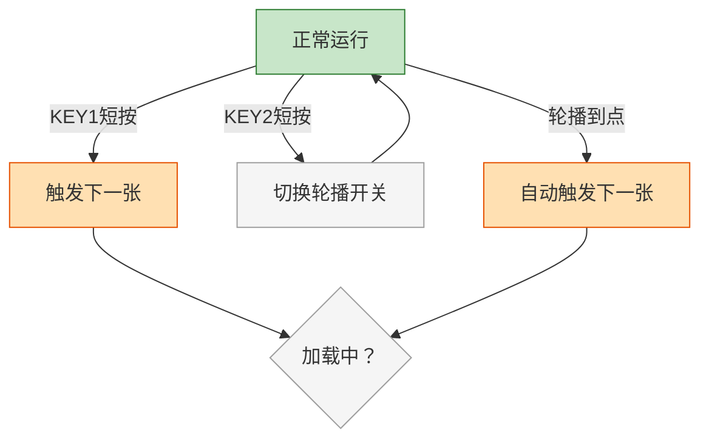

> **图注**：正常运行态有3种触发源——KEY1短按（手动下一张）、KEY2短按（切换自动轮播开关）、自动轮播到点（1秒固定间隔）。关键：KEY2只切换开关不触发切换，KEY2短按后直接回到正常运行，不进入加载判断；手动和自动都走同一个"加载中？"判断。结论：3种触发源统一汇入加载判断，避免重复逻辑。

**图2-4c 加载与挂起流程：**

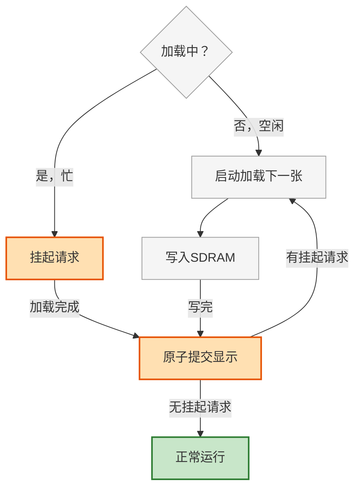

> **图注**：加载判断分两支——空闲则立即加载，忙则挂起（next_req_pending=1，只记1次不累积）。加载完成→原子提交→检查是否有挂起请求，有则继续加载，无则回到正常运行。关键信号：load_busy、next_req_pending、write_finish_pulse、disp_buf_idx。结论：挂起机制保证按键不丢失，同时防止连跳。


> 图中橙色节点⑧是**原子提交**——最关键的一步，一个时钟周期同时更新6个寄存器；绿色节点⑨是**正常运行**——三种触发方式的入口。

**状态机的关键特点：**
1. 没有显式的state寄存器，用标志位组合判断状态
2. 扫描和加载是"一次性触发"的——用单拍pulse启动，bmp_read内部有自己的状态机
3. 加载忙时（load_busy=1）不接受新的加载请求，但会用`next_req_pending`挂起请求
4. 写完成信号需要跨时钟域同步——从mem_clk域的电平翻转，同步到clk域的单拍脉冲
5. **正常运行有三种触发方式**：KEY1短按（下一张）、KEY2短按（切换自动轮播开关）、自动轮播计时到（自动下一张）。注意KEY2短按只切换开关，不触发加载

**两个容易忽略的关键细节：**

**① 为什么要判断bmp_ready？**
扫描和加载启动前都要判断`bmp_ready=1`，因为bmp_read模块本身也需要初始化时间——上电后bmp_read要先完成SD卡初始化（发送CMD0、CMD8、ACMD41等命令），初始化完成后才会拉高bmp_ready。如果不判断bmp_ready就发scan_start_pulse，bmp_read还没准备好，扫描启动脉冲会被忽略，导致系统卡死在"等待扫描"状态。

**② source_done_seen的作用是什么？**
`source_done_seen`标志位区分了两个"完成"：

- **源数据送完**：bmp_read把一帧307200像素全部送进了写FIFO（bmp_data_wr_en不再有效），此时`source_done_seen=1`
- **SDRAM写完**：SDRAM控制器把FIFO里的数据全部写入SDRAM，此时`write_finish_toggle`翻转，同步后产生`write_finish_pulse`

这两个事件不是同时发生的——源数据送完时，FIFO里可能还有数据没写入SDRAM。必须等`write_finish_pulse`到达（SDRAM真正写完）才能切换显示，否则会显示半帧旧图半帧新图（撕裂）。`source_done_seen`的作用就是让控制逻辑知道"源数据已经送完了，现在只等SDRAM写完"，避免重复启动加载。

### 1.6 双缓冲原子提交机制

这是官方例程设计最精妙的部分之一。完整的提交流程分三步：

**图2-5 双缓冲原子提交时序图：**

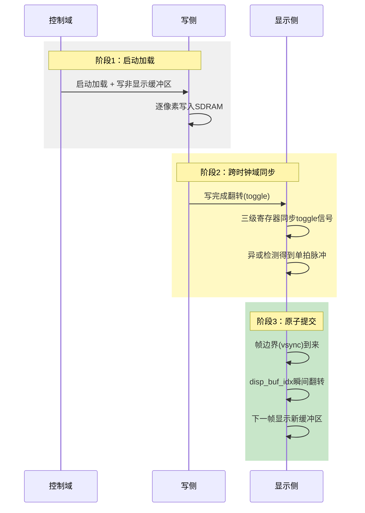

> **图注**：双缓冲原子提交3阶段——启动加载（灰：写非显示缓冲区，不影响当前显示）→跨时钟域同步（黄：toggle电平翻转经三级寄存器同步+异或检测得到单拍脉冲，避免亚稳态）→原子提交（绿：vsync帧边界瞬间翻转disp_buf_idx，下一帧整帧切换新缓冲区，杜绝撕裂）。关键信号：load_start_pulse、write_buf_idx、write_finish_toggle、disp_buf_idx、vsync。结论：写显示分离+帧边界切换=无撕裂。

**详细三步讲解：**

**第一步，控制时钟域启动加载。** `load_start_pulse`单拍脉冲，同时设置`write_buf_idx`和`pending_buf_idx`，`load_busy=1`。然后bmp_read开始读BMP，像素数据通过FIFO写入SDRAM的`write_buf_idx`缓冲区。整帧307200个像素都写完之后，SDRAM控制器把`write_finish_toggle`翻转一下——注意是电平翻转，不是单拍脉冲，因为这个信号要跨时钟域。

**第二步，跨时钟域同步。** `write_finish_toggle`是从SDRAM时钟域（mem_clk）来的，控制逻辑在clk域（也是100MHz，但不同PLL输出，算不同时钟域）。所以用了三级移位寄存器`wrfin_tgl_sync[2:0]`来同步——每个时钟上升沿左移一位。然后用`wrfin_tgl_sync[2] ^ wrfin_tgl_sync[1]`来检测脉冲——如果相邻两位不一样，说明电平翻转了，异或结果就是1，持续一个时钟周期，正好是一个单拍脉冲。

这个方法就是"电平翻转+三级寄存器+异或检测"，是跨时钟域传单拍脉冲的标准方法。

**第三步，原子提交。** 当`write_finish_pulse=1`的时候，同时更新六个寄存器：

- `load_busy`清零
- `source_done_seen`清零
- `disp_buf_idx`切换到`pending_buf_idx`
- `img_idx`更新为`load_idx`
- `display_valid`置1
- `first_image_committed`置1

**为什么叫"原子提交"？** 因为这六个寄存器在同一个时钟沿同时更新，中间没有任何中间状态。显示侧是组合逻辑根据`disp_buf_idx`选择读哪个缓冲区，所以`disp_buf_idx`一变，下一个时钟周期读的数据就来自新的缓冲区了。画面瞬间从旧图变成新图，没有半新半旧的中间状态，没有撕裂。

大家想想，如果不是原子提交，而是先改`disp_buf_idx`，过几个周期再改`img_idx`，会发生什么？那几个周期里，显示缓冲区已经是新的了，但图片编号还是旧的，数码管显示和画面就不一致了。虽然用户可能看不出来，但这是设计不严谨。原子提交就没有这个问题，所有相关寄存器同时更新，状态永远是一致的。

### 1.7 防连跳机制 next_req_pending

这也是官方例程的一个设计亮点。当用户在加载忙的时候按按键，不会立即执行，而是挂起请求，等当前加载完再执行。

**图2-6 防连跳机制流程图：**

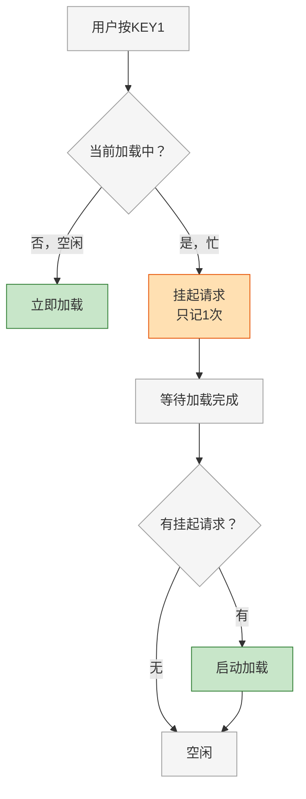

> **图注**：防连跳核心是next_req_pending寄存器——加载中按键时不立即触发，而是置位next_req_pending=1（只记1次，重复按键不累积）。加载完成后检查该标志，有则继续加载下一张，无则回到空闲。关键信号：load_busy、next_req_pending、write_finish_pulse。结论：1位寄存器解决按键丢失和连跳两个问题。

**为什么能防连跳：**   

- `next_req_pending`只有1位，只能记0或1，不会累积成"按了3次就跳3张"
- 忙的时候不管按多少次，都只记1次请求
- 加载完成后，如果有挂起的请求，就执行一次，然后清零
- 这样即使快速连按，也只会在当前加载完后跳一张，不会连跳

### 1.8 自动轮播计时机制

```verilog
assign auto_tick = (auto_cnt == (CLK_FREQ_HZ - 1));  // 计数到99999999 = 1秒

// 自动播放计数：只有当前没有写图任务时才计时
if (scan_done && auto_play_en && display_valid && !load_busy 
    && first_image_committed && (img_found_count > 3'd1)) begin
    if (auto_tick)
        auto_cnt <= 32'd0;
    else
        auto_cnt <= auto_cnt + 32'd1;
end else begin
    auto_cnt <= 32'd0;  // 不满足条件时清零
end
```

**关键细节：**
- 只有在"扫描完成、自动轮播开、显示有效、不忙、首图已提交、图片数>1"时才计时
- 任何一个条件不满足，计数器就清零——这样加载完成后会重新从0开始计时，不会"加载时间也算进轮播间隔"
- 1秒 = 100MHz × 1s = 100,000,000个周期，计数到99,999,999（因为从0开始）

---

## 二、三个优化功能的实现思路

官方例程已经有了下一张和自动轮播，但交互体验还有提升空间。我们做三个优化，全部只改`sd_card_bmp.v`一个文件，不碰其他任何文件。

### 2.1 优化一：加上一张功能（KEY2长按1秒触发）

**需求：** KEY1短按=下一张，KEY2短按=自动轮播开关，KEY2长按1秒=上一张。

**为什么用KEY2长按而不是加新按键？**

- 开发板上只有KEY1和KEY2两个用户按键
- 短按和长按时长不同，可以区分两种功能
- 不需要额外的硬件，纯软件实现

**实现思路：**

**图2-7 长按检测流程图：**

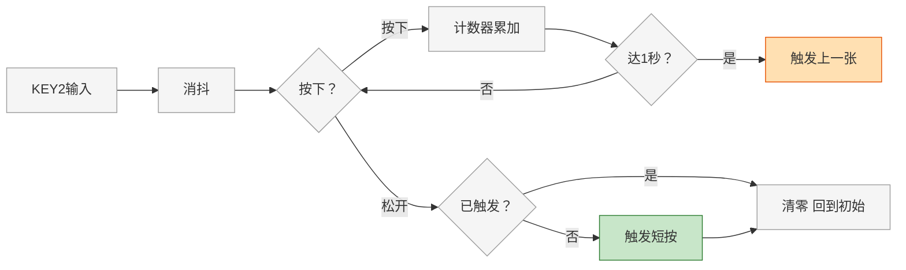

> **图注**：长按检测用计数器实现——消抖后按下则计数器累加，达到1秒（100M时钟=100_000_000周期）触发长按事件（上一张）；松开时检查是否已触发长按，已触发则清零不触发短按，未触发则触发短按事件（切换自动轮播）。关键参数：LONG_PRESS_MS=1000，消抖20ms。结论：同一按键通过按时长区分短按/长按，节省IO资源。

> **Note：** 消抖时间由`key_press_debounce`模块内部参数控制（默认20ms）；长按阈值为1秒（100_000_000周期@100MHz）；`long_press_marked`标志用于区分"长按后松开"和"短按"。

第一步，按键消抖。这个官方已经有了，`key_press_debounce`模块输出`key_auto_press`单拍脉冲。但注意啊，官方的消抖模块只输出'按下沿'的单拍脉冲，不输出消抖后的稳定状态。咱们要做长按检测，需要知道按键'是否一直按住'，所以需要新增一个寄存器`key_auto_stable`来保存消抖后的稳定状态。

怎么得到这个稳定状态？其实很简单——`key_press_debounce`内部已经有`button_stable`寄存器了，只是没有引出来。咱们有两个选择：一个是修改`key_press_debounce`模块，把`button_stable`作为输出端口引出来；另一个是在`sd_card_bmp`里自己再做一次消抖。

哪个更好？第一个更好——修改消抖模块加一个输出端口，改动最小，而且复用已有的消抖逻辑，不会出错。但注意啊，`key_press_debounce`模块是定义在`sd_card_bmp.v`文件末尾的，咱们改它的端口，同时也要改实例化的时候的端口连接。

好，假设咱们已经有了`key_auto_stable`信号（1=松开，0=按下），接下来怎么做？

第二步，长按计数。新增一个寄存器`long_press_cnt[31:0]`，当`key_auto_stable == 0`（按键按住）的时候，计数器累加；当`key_auto_stable == 1`（按键松开）的时候，计数器清零。

第三步，长按触发。当`long_press_cnt`计数达到1秒对应的周期数（100MHz×1s=100_000_000）的时候，触发上一张请求——`prev_req_pending <= 1`，同时设置一个`long_press_marked <= 1`标记。

这里大家可能会问，为什么需要`long_press_marked`这个标记？原因很简单：**防止按住不放时重复触发**。你想啊，如果用户按住KEY2不放，计数器到1秒触发了一次上一张，这时候如果没有标记，计数器会继续累加——到2秒的时候又会触发一次，到3秒又触发一次，结果就是按住不放会每秒跳一张，这显然不是我们想要的。

所以加了`long_press_marked`之后，逻辑是这样的：计数到1秒的时候，检查`long_press_marked`是不是0——如果是0，说明还没触发过，那就触发上一张，同时把`long_press_marked`置1；如果已经是1了，说明已经触发过了，就什么都不做。等用户松开按键的时候，把`long_press_marked`清零，下一次长按才能再触发。

这样就保证了：**不管按住多久，一次长按只触发一次上一张**。这个设计跟消抖模块的思路是一样的——都是检测沿（按下沿/长按到达沿），而不是检测电平，避免重复触发。

好，长按检测的逻辑就这些。接下来是上一张请求的处理。

上一张请求用`prev_req_pending`挂起，跟`next_req_pending`完全对称。在正常运行状态下，当不忙（`!load_busy`）且有上一张请求（`prev_req_pending=1`）的时候，启动加载上一张——`load_idx = prev_index_limited(img_idx, img_found_count)`（上一张图片编号），`load_sector = sector_lut(load_idx)`（查上一张的扇区地址），`pending_buf_idx = next_buf_lut(disp_buf_idx, display_valid)`（还是写非显示缓冲区），`load_start_pulse=1`，`load_busy=1`，`prev_req_pending=0`，`auto_cnt=0`。

这里需要新增一个函数`prev_index_limited`，跟`next_index_limited`对称，计算上一张图片编号——不是加1，而是减1。比如4张图的时候，当前是0，上一张就是3；当前是1，上一张就是0。逻辑跟`next_index_limited`完全对称。

还有一个优先级问题：如果同时有上一张请求和下一张请求怎么办？理论上不会同时有，因为用户不可能同时按KEY1和KEY2长按。但为了严谨，咱们定义**下一张优先**——先处理`next_req_pending`，处理完之后下一个时钟周期再处理`prev_req_pending`。因为下一张是更常用的操作，而且代码里用if-else if就能很自然地实现优先级。

好，加上一张功能需要新增的东西总结一下：

- 修改`key_press_debounce`模块，增加`button_stable`输出端口
- 修改`key_auto`消抖模块的实例化，连接新端口
- 新增parameter `LONG_PRESS_MS = 1000`（长按时间，默认1秒）
- 新增寄存器`key_auto_stable`、`long_press_cnt`、`long_press_marked`、`prev_req_pending`
- 新增函数`prev_index_limited`
- 新增长按检测逻辑（计数器、触发、标记）
- 新增上一张请求处理逻辑（跟下一张对称）

总改动量大概30行代码，全部在`sd_card_bmp.v`一个文件里。

好，加上一张就讲到这里。接下来是第二个优化：自动轮播间隔可配置。"


**关键设计点：**

1. 需要新增一个寄存器`key_auto_stable`来保存消抖后的稳定按键状态（原有的`key_press_debounce`只输出press_pulse，不输出稳定状态）
2. 长按计数器：按键按下时累加，松开时清零
3. 长按标记`long_press_marked`：长按触发后置1，松开时检查这个标记——如果已经触发过长按，就不要再触发短按事件（避免"长按松开后又触发一次短按"）
4. 上一张请求也用`prev_req_pending`挂起，和`next_req_pending`一样的防连跳机制
5. 上一张的图片编号计算：和`next_index_limited`类似，但是减1而不是加1

**需要新增的寄存器：**
```verilog
reg         key_auto_stable;      // KEY2消抖后的稳定状态（1=松开，0=按下）
reg [31:0]  long_press_cnt;       // 长按计数器
reg         long_press_marked;     // 长按已触发标记
reg         prev_req_pending;      // 上一张请求挂起标志
```

**需要新增的函数：**

```verilog
function [1:0] prev_index_limited;  // 计算上一张图片编号（和next_index_limited对称）
    input [1:0] cur;
    input [2:0] count;
    begin
        case (count)
            3'd0: prev_index_limited = 2'd0;
            3'd1: prev_index_limited = 2'd0;
            3'd2: prev_index_limited = (cur == 2'd0) ? 2'd1 : (cur - 2'd1);
            3'd3: prev_index_limited = (cur == 2'd0) ? 2'd2 : (cur - 2'd1);
            default: prev_index_limited = (cur == 2'd0) ? 2'd3 : (cur - 2'd1);
        endcase
    end
endfunction
```

**上一张请求的处理逻辑（跟下一张完全对称）：**

在原来处理`next_req_pending`启动加载的always块中，增加一个`prev_req_pending`的分支：
- 当`!load_busy`（不忙）且`prev_req_pending == 1`时，启动加载上一张
- `load_idx = prev_index_limited(img_idx, img_found_count)`（上一张图片编号）
- `load_sector = sector_lut(load_idx)`（查上一张的扇区地址）
- `pending_buf_idx = next_buf_lut(disp_buf_idx, display_valid)`（还是写非显示缓冲区）
- `load_start_pulse = 1`，`load_busy = 1`，`prev_req_pending = 0`，`auto_cnt = 0`

跟下一张的区别只有一个：图片编号计算用`prev_index_limited`而不是`next_index_limited`。其他逻辑（写非显示缓冲区、原子提交、防连跳）完全复用。

**优先级问题：**

如果同时有上一张请求和下一张请求（理论上不会发生，因为用户不可能同时按KEY1和KEY2长按，但为了严谨），定义**下一张优先**——先处理`next_req_pending`，处理完之后下一个时钟周期再处理`prev_req_pending`。因为下一张是更常用的操作。

### 2.2 优化二：自动轮播间隔可配置

**需求：** 把自动轮播间隔从固定的1秒改成可配置的参数，默认3秒，可以通过parameter修改。

**为什么要可配置？**
- 1秒太快了，演示的时候评委还没看清就切走了
- 不同场景需要不同的轮播速度——快速展示用2秒，慢慢欣赏用5秒甚至10秒
- 参数化设计是FPGA的好习惯，改一个数字就能调整，不用改代码逻辑

**实现思路：**

原来的代码：
```verilog
assign auto_tick = (auto_cnt == (CLK_FREQ_HZ - 1));  // 固定1秒
```

改成：
```verilog
parameter integer AUTO_PLAY_MS = 3000;  // 自动轮播间隔，默认3秒

wire [31:0] auto_play_cycles = (CLK_FREQ_HZ / 1000) * AUTO_PLAY_MS;
assign auto_tick = (auto_cnt == (auto_play_cycles - 1));
```

**关键设计点：**
1. 新增parameter `AUTO_PLAY_MS`，单位是毫秒，默认3000ms（3秒）
2. 用`(CLK_FREQ_HZ / 1000) * AUTO_PLAY_MS`计算对应的时钟周期数，这样不管时钟频率是多少，参数都是毫秒单位，直观易懂
3. 计数器的上限从`CLK_FREQ_HZ - 1`改成`auto_play_cycles - 1`
4. 其他逻辑完全不变——计时条件、清零条件、触发条件都不变

**注意事项：**
- `AUTO_PLAY_MS`不要设太小（比如<500ms），不然图片还没加载完就又要切了，会导致一直加载不出来
- 也不要设太大（比如>60秒），32位计数器足够大，但演示的时候等太久也不好
- 建议范围：1000ms ~ 10000ms

### 2.3 优化三：数码管显示当前图片编号

**需求：** 把数码管从显示`state_code`（BMP读取状态机的状态码）改成显示当前图片编号（1~4）。

> 说明：本节课先做最简版本——只显示图片编号。错误码显示、加载中闪烁等进阶效果留到第3课（稳定性增强）详细讲。

**为什么要改？**

- 原来显示的state_code是bmp_read内部的状态码，比如0=空闲、1=初始化、2=读扇区……这些状态对用户来说没有意义
- 用户更关心的是"当前显示的是第几张图"，这个信息直观有用
- 出错的时候显示错误码，方便调试

**实现思路：**

原来的代码：`state_code`直接来自`bmp_read`模块的输出，透传给数码管。

改成：在`sd_card_bmp`里新增一个`seg_display`寄存器，根据当前状态选择显示内容：
- 正常显示时：显示`img_idx + 1`（图片编号从1开始，不是从0开始）
- 加载中时：显示一个特殊标记（比如显示"."或者闪烁）
- 出错时：显示错误码

第一步，把`state_code`从wire改成reg。原来它是wire，直接连到bmp_read的`state_code`输出。现在咱们要自己控制它的值，所以改成reg，在always块里赋值。

第二步，在always块里给`state_code`赋值：

```verilog
state_code <= {2'b0, img_idx} + 4'd1;  // 显示1~4
```

就这一行。`img_idx`是当前显示的图片编号，0到3，加1之后就是1到4，用户看到的就是'第1张、第2张、第3张、第4张'。

为什么要加1？因为程序员习惯从0开始编号，但用户习惯从1开始——你跟用户说'当前显示第0张图'，用户会懵。加1之后就符合用户的习惯了。

就这么简单，两步改动，一行代码。端口名不变，顶层的连接也不变，只是内容变了。

那加载的时候显示什么？最简单的做法是加载的时候也显示当前显示的图片编号——因为加载不影响当前显示，当前显示的还是那张图，所以显示当前图片编号是对的。如果你想更直观一点，可以让加载的时候数码管闪烁，或者显示正在加载的图片编号，但这些都是锦上添花，不是必须的。咱们先做最简单的——一直显示当前显示的图片编号。

还有一个问题：出错的时候显示什么？比如TF卡没插、没有找到BMP，这时候`img_found_count=0`，`img_idx=0`，显示的就是1。但这时候其实没有图片，显示1会误导用户。所以可以加个判断——如果`img_found_count==0`，显示一个错误码，比如显示0（或者显示15，也就是数码管全亮，表示错误）。但这个也是锦上添花，咱们这节课先做最简单的版本，错误处理留到第3课详细讲。


**图2-8 数码管显示内容选择流程图：**

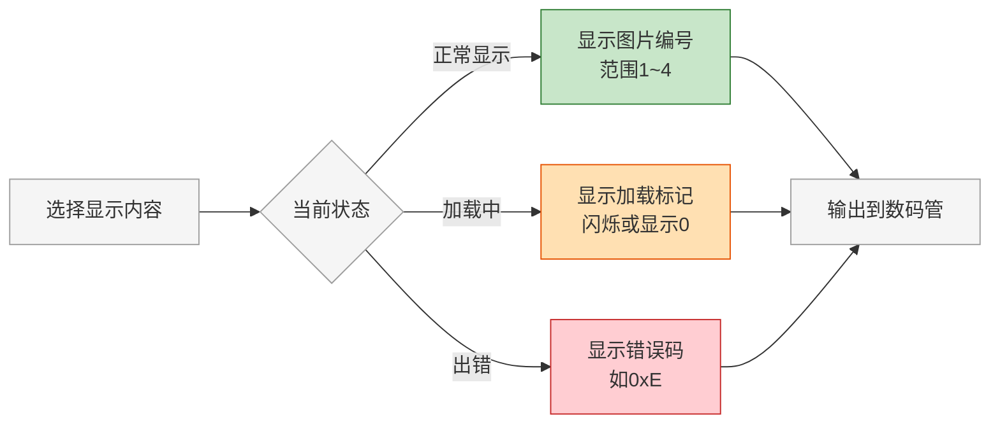

> **图注**：数码管显示3种状态——正常（绿：显示当前图片编号1~4）、加载中（橙：闪烁或显示0提示正在加载）、出错（红：显示错误码如0xE）。通过state_code寄存器选择显示内容（第2课从透传bmp_read状态码改为显示图片编号）。注意：图中加载中/出错分支为进阶效果，本节课只实现正常显示图片编号。结论：数码管是最简单的状态反馈渠道，调试时优先看它。

**关键设计点：**
1. 新增输出端口`seg_display[3:0]`（或者直接复用state_code端口，把里面的内容换掉）
2. 图片编号要+1，因为`img_idx`是0~3，用户看到的应该是1~4
3. 加载中可以让数码管闪烁（比如加载时显示0，或者显示当前正在加载的图片编号）
4. 最简单的实现：直接显示`img_idx + 1`，加载中也显示当前显示的图片编号（因为加载不影响当前显示）

**最简实现（推荐）：**
```verilog
// 在端口部分，把state_code的含义改成图片编号
// 原来：output [3:0] state_code,
// 现在：output reg [3:0] state_code,  // 复用这个端口，内容改成图片编号

// 在always块里赋值
state_code <= {2'b0, img_idx} + 4'd1;  // 显示1~4
```

这样改最小——端口名不变，顶层不用改，只是把端口里的内容从bmp_read的状态码改成了图片编号。

### 2.4 三个优化的代码修改点汇总

| 优化项 | 新增/修改 | 具体位置 |
|---|---|---|
| 加上一张 | 新增parameter `LONG_PRESS_MS=1000` | parameter区 |
| 加上一张 | 新增寄存器`key_auto_stable`、`long_press_cnt`、`long_press_marked`、`prev_req_pending` | 寄存器声明区 |
| 加上一张 | 新增函数`prev_index_limited` | 函数区 |
| 加上一张 | 新增长按检测逻辑（按键稳定状态采样、计数器、长按触发） | always块 |
| 加上一张 | 新增上一张请求处理（和下一张对称的加载启动逻辑） | always块的加载启动部分 |
| 轮播可配置 | 新增parameter `AUTO_PLAY_MS=3000` | parameter区 |
| 轮播可配置 | 修改`auto_tick`的计算方式 | assign区 |
| 数码管显示 | 修改`state_code`的赋值，从透传bmp_read改成显示图片编号 | always块 |
| 数码管显示 | 把`state_code`从wire改成reg | 端口声明区 |

**总改动量：** 约新增50行代码，修改约10行代码，全部在`sd_card_bmp.v`一个文件内。

### 2.5 改动位置示意图

所有改动都在`sd_card_bmp.v`一个文件内，分布在6个位置：

**图2-9 改动位置示意图：**

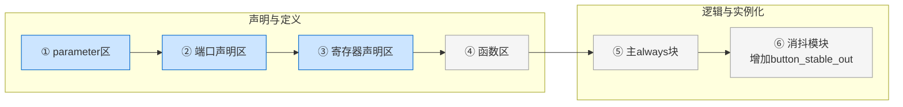

> **图注**：第2课改动分布在6个位置——parameter区（新增LONG_PRESS_MS、AUTO_PLAY_MS）、端口声明（state_code从wire改成reg）、寄存器声明（新增key_auto_stable、long_press_cnt、long_press_marked、prev_req_pending）、函数区（新增prev_index函数）、主always块（新增长按检测、上一张逻辑、修改auto_tick、state_code赋值改为图片编号）、消抖模块（增加button_stable_out端口）。结论：改动集中在主always块和parameter区，端口名不变，顶层无需修改。


### 2.6 完整修改代码（按位置标注）

以下是所有修改和新增的完整代码，标注了插入位置，可以直接复制使用。

#### 修改点①：parameter区（在原有4个parameter之后新增）

```verilog
    parameter integer CLK_FREQ_HZ       = 100_000_000,
    parameter [31:0]  SCAN_START_SECTOR = 32'd0,
    parameter [31:0]  SCAN_MAX_SECTOR   = 32'd131071,
    parameter [2:0]   SCAN_TARGET_COUNT = 3'd4,
    // === 新增：长按时间和轮播周期可配置 ===
    parameter integer LONG_PRESS_MS      = 1000,   // KEY2长按触发时间，默认1秒
    parameter integer AUTO_PLAY_MS       = 3000    // 自动轮播间隔，默认3秒
```

#### 修改点②：端口声明区（state_code从wire改成reg）

```verilog
    // 原来：output [3:0] state_code,
    // 改成：
    output reg [3:0]            state_code,         // 数码管显示（复用端口，内容改为图片编号）
```

#### 修改点③：寄存器声明区（在原有寄存器之后新增）

```verilog
    // === 新增：KEY2长按检测相关寄存器 ===
    reg         key_auto_stable;      // KEY2消抖后的稳定状态（1=松开，0=按下）
    reg [31:0]  long_press_cnt;       // 长按计数器
    reg         long_press_marked;     // 长按已触发标记（防止按住不放重复触发）
    reg         prev_req_pending;      // 上一张请求挂起标志（和next_req_pending对称）
```

#### 修改点④：函数区（在原有3个函数之后新增）

```verilog
    // === 新增：计算上一张图片编号（和next_index_limited对称，减1而不是加1）===
    function [1:0] prev_index_limited;
        input [1:0] cur;      // 当前图片编号
        input [2:0] count;    // 已找到的图片总数
        begin
            case (count)
                3'd0: prev_index_limited = 2'd0;
                3'd1: prev_index_limited = 2'd0;
                3'd2: prev_index_limited = (cur == 2'd0) ? 2'd1 : (cur - 2'd1);
                3'd3: prev_index_limited = (cur == 2'd0) ? 2'd2 : (cur - 2'd1);
                default: prev_index_limited = (cur == 2'd0) ? 2'd3 : (cur - 2'd1);
            endcase
        end
    endfunction
```

#### 修改点⑤：主always块（4处修改/新增）

**⑤-a：轮播周期计算（把原来的auto_tick assign替换掉）**

```verilog
    // 原来：assign auto_tick = (auto_cnt == (CLK_FREQ_HZ - 1));
    // 改成：
    wire [31:0] auto_play_cycles = (CLK_FREQ_HZ / 1000) * AUTO_PLAY_MS;
    assign auto_tick = (auto_cnt == (auto_play_cycles - 1));
```

**⑤-b：长按检测逻辑（在主always块中新增，建议放在按键处理部分附近）**

```verilog
    // === 新增：KEY2长按检测 ===
    // 长按计数器：按住时累加，松开时清零
    if (key_auto_stable == 1'b0) begin  // 按键按住
        if (long_press_cnt < ((CLK_FREQ_HZ / 1000) * LONG_PRESS_MS - 1)) begin
            long_press_cnt <= long_press_cnt + 32'd1;
        end else if (!long_press_marked) begin
            // 计数达到长按时间，且尚未触发过 → 触发上一张
            long_press_marked <= 1'b1;
            prev_req_pending <= 1'b1;    // 挂起上一张请求
        end
    end else begin  // 按键松开
        long_press_cnt <= 32'd0;
        long_press_marked <= 1'b0;
    end
```

**⑤-c：上一张请求处理（在原来处理next_req_pending启动加载的逻辑旁边，新增一个分支）**

```verilog
    // === 新增：上一张请求处理（跟下一张完全对称，下一张优先）===
    if (!load_busy && next_req_pending) begin
        // ... 原有的下一张加载启动逻辑（保持不变）...
    end else if (!load_busy && prev_req_pending) begin
        // 上一张：只有下一张没有请求时才处理（下一张优先）
        load_idx <= prev_index_limited(img_idx, img_found_count);
        load_sector <= sector_lut(prev_index_limited(img_idx, img_found_count));
        pending_buf_idx <= next_buf_lut(disp_buf_idx, display_valid);
        write_buf_idx <= next_buf_lut(disp_buf_idx, display_valid);
        load_start_pulse <= 1'b1;
        load_busy <= 1'b1;
        prev_req_pending <= 1'b0;
        auto_cnt <= 32'd0;
    end
```

> 注意：实际代码中需要把下一张和上一张的处理放在同一个always块的同一个条件判断里，用if-else if保证下一张优先。上面的代码片段为了清晰分开写了，实际合并时注意不要重复判断`!load_busy`。

**⑤-d：数码管显示图片编号（在主always块中新增，建议放在原子提交之后）**

```verilog
    // === 新增：数码管显示当前图片编号（1~4）===
    state_code <= {2'b0, img_idx} + 4'd1;
```

#### 修改点⑥：key_press_debounce模块（新增button_stable输出端口）

```verilog
module key_press_debounce #(
    parameter integer CLK_FREQ_HZ = 100_000_000,
    parameter integer DEBOUNCE_MS = 20
)(
    input  wire clk,
    input  wire rst,
    input  wire button_in,
    output reg  press_pulse,
    // === 新增：消抖后的稳定状态输出（用于长按检测）===
    output reg  button_stable_out
);
```

然后在模块内部，把原来的`button_stable`寄存器同时赋值给`button_stable_out`：
```verilog
    // 在更新button_stable的地方，同时更新button_stable_out
    button_stable <= button_sync1;
    button_stable_out <= button_sync1;  // 新增：同步输出
```

最后修改KEY2消抖模块的实例化，连接新端口：
```verilog
    key_press_debounce #(
        .CLK_FREQ_HZ(CLK_FREQ_HZ),
        .DEBOUNCE_MS(20)
    ) u_key_auto (
        .clk(clk),
        .rst(rst),
        .button_in(key_auto),
        .press_pulse(key_auto_press),
        .button_stable_out(key_auto_stable)   // 新增：连接消抖后的稳定状态
    );
```

### 2.7 验证方法（改完之后怎么确认改对了）

改完代码编译上板后，按以下顺序验证，每一步都通过了才算改对：

| 序号 | 测试用例 | 操作 | 预期结果 | 验证什么 |
|---|---|---|---|---|
| 1 | 原有功能-下一张 | 按KEY1短按 | 切换到下一张图片 | 确认下一张功能没被改坏 |
| 2 | 原有功能-自动轮播开关 | 按KEY2短按 | 自动轮播开启/关闭，数码管旁的指示灯（如果有）状态变化 | 确认KEY2短按功能没被改坏 |
| 3 | 新功能-上一张 | 按住KEY2不放，等1秒后松开 | 切换到上一张图片 | 长按触发上一张功能 |
| 4 | 短按不触发上一张 | 按KEY2短按（<0.5秒就松开） | 只切换自动轮播开关，不切换图片 | 短按和长按区分正确 |
| 5 | 长按不重复触发 | 按住KEY2不放3秒 | 只触发一次上一张，不会每秒跳一张 | long_press_marked防重复触发有效 |
| 6 | 忙时上一张请求挂起 | 正在加载图片时（刚按完KEY1）立即按住KEY2长按1秒 | 当前图片加载完成后，自动切换到上一张 | prev_req_pending挂起机制有效 |
| 7 | 轮播周期3秒 | 开启自动轮播，用秒表计时 | 大约3秒切换一张（不是1秒） | AUTO_PLAY_MS参数生效 |
| 8 | 数码管显示图片编号 | 观察数码管 | 显示1~4，按KEY1切换时数字同步+1，按KEY2长按时数字同步-1 | state_code改成图片编号生效 |
| 9 | 首图自动加载 | 上电复位 | 自动显示第1张图，数码管显示1 | 首图加载逻辑没被改坏 |
| 10 | 只有1张图时 | TF卡只放1张BMP | 按KEY1和KEY2长按都不切换（因为只有1张图） | prev_index_limited和next_index_limited的数量限制有效 |

> 以上10个测试用例全部通过，说明三个优化都正确实现了，且原有功能没有被破坏。

---

### 2.8 seg7_panel数码管面板详解（完赛工程）

官方例程的数码管只显示简单的状态码，完赛工程升级为**三页面自动轮播面板**，能显示图片编号、音量、轮播周期三种信息。

**三个页面**：

- **PIC页**：`_ _ _ _ _ P I C n`，n=1..4，显示当前图片编号
- **VOL页**：`V O L _ _ _ d d d`，显示音量0..255（十进制）
- **PRD页**：`P R D _ _ _ d d S`，显示轮播周期（秒）和单位

**核心机制**：

1. **页面自动轮播**：每1秒自动切换页面（PIC→VOL→PRD→PIC循环）
2. **事件强制显示**：按按键切换图片时强制显示PIC页2秒，调节音量时强制显示VOL页2秒
3. **动态扫描**：8位数码管用1路扫描，每8192个时钟周期（50MHz下约1.31ms）切换一位，人眼看不到闪烁
4. **BCD转换**：音量0..255用double-dabble算法转成3位BCD十进制显示

**关键参数**：
```verilog
parameter SCAN_STEP_CYCLES = 8192;      // 每位扫描间隔
parameter PAGE_PERIOD_CYCLES = 50000000; // 页面轮播周期1秒
parameter HOLD_CYCLES = 100000000;       // 事件强制显示2秒
```

**数码管引脚约定**（和官方例程一致）：

- 位选`dig_n`：低有效one-hot，8位对应8个数码管

- 段选`seg_n`：低有效，`{dp, g,f,e,d,c,b,a}`，bit0=A段，bit7=小数点

	#### 核心原理：四步

	第一步，**页面选择**。有一个页面计数器，每1秒加1，在PIC、VOL、PRD三个页面之间循环。如果有事件来了（比如调音量），就强制跳到对应页面，同时启动一个2秒的保持定时器，2秒之后再恢复自动轮播。

	第二步，**动态扫描**。8位数码管，不是8位同时亮的，是一位一位轮流亮的。每8192个时钟周期切换一位，50MHz的话就是大约1.31毫秒切换一位，8位一轮就是大约10毫秒，也就是100Hz。人眼的视觉暂留效应，你就觉得8位是同时亮的，看不到闪烁。

	第三步，**BCD转换**。音量是0到255，要显示成三位十进制，怎么办？用double-dabble算法，把二进制转成BCD码。这个算法很巧妙，不用除法器，只用移位和加3，资源占用很小。

	第四步，**段码输出**。根据当前显示的数字和位选信号，输出对应的段码。段码是低有效的，bit0是A段，bit7是小数点。

	这里我特别强调一下引脚约定。完赛工程的数码管引脚约定和官方例程是完全一致的——位选dig_n是低有效one-hot，段选seg_n是低有效，{dp,g,f,e,d,c,b,a}的顺序。为什么要强调这个？因为如果你自己写数码管驱动，引脚顺序搞反了，显示就会乱掉。完赛工程直接沿用官方例程的约定，就不会出这个问题。

	**三页面自动轮播+事件强制显示+动态扫描+BCD转换**

### 2.9 按键处理架构演进（从消抖到组合键路由）

官方例程只有简单的`key_press_debounce`（20ms消抖），完赛工程升级为**完整的按键事件处理架构**，支持单击、长按、双键组合三种事件。

**三层架构**：

```
按键输入 → dual_key_chord_router（事件路由） → media_policy（策略决策） → media_player_control（执行）
```

**第一层：dual_key_chord_router（双键组合路由）**

- 输入：KEY2、KEY3两个按键（低有效）
- 输出：
  - `key2_event`：KEY2单击事件（上一张）
  - `key3_event`：KEY3单击事件（下一张/自动轮播切换）
  - `key3_long_event`：KEY3长按1秒事件（亮度阶梯调节）
  - `save_event`：KEY2+KEY3同时长按3秒事件（保存配置到Flash）
- 内部状态机：IDLE→KEY2/KEY3/CHORD（双键同时按下），CHORD状态下再长按3秒触发save_event

**第二层：dual_key_long_hold_guard（长按保护）**

- 防止长按过程中误触发单击事件
- 消抖时间1000000周期（20ms@50MHz）
- 长按判定时间100000000周期（2秒@50MHz）

**第三层：media_policy（媒体策略）**

- 根据按键事件决定具体行为
- KEY2单击→上一张图片
- KEY3单击→下一张图片（手动模式）或切换自动/手动模式
- KEY3长按→亮度调节模式
- 双键长按→保存配置到Flash

**为什么要这样分层？**

1. **职责清晰**：消抖/事件识别/策略决策/执行分开，每层只做一件事
2. **可扩展**：新增按键功能只改policy层，不用动底层消抖
3. **可测试**：每层可以独立写Testbench验证
4. **避免误触**：长按保护确保长按过程中不会误触发单击

---

## 三、从官方例程到完赛工程：控制架构的演进

我们刚才做的三个优化，是在官方例程的基础上做最小改动。那完赛工程的控制架构是什么样的？它和官方例程有什么本质区别？

### 3.1 官方例程控制架构的局限

官方例程的控制逻辑全部集中在`sd_card_bmp.v`一个文件里，350行代码，包含了：
- 按键消抖
- BMP扫描
- 图片加载
- 双缓冲控制
- 自动轮播
- 状态码输出

这种"all-in-one"的设计在功能简单的时候没问题，但想扩展更多功能的时候就会遇到瓶颈：

1. **按键功能无法扩展**：只有两个按键，每个按键只有短按一种功能，想加更多功能（上一张、菜单、保存设置）就不够用了
2. **轮播周期固定**：写死了1秒，想改成可配置需要改代码，不能运行时调整
3. **数码管信息单一**：HX4S20C开发板是8位数码管，但官方例程只输出一个4位的`state_code`（只用了低4位），想显示更多信息（图片编号、音量、轮播周期）就做不到，信息容量远远不够
4. **没有帧边界提交**：官方例程的显示切换是在收到write_finish_pulse时立即切换，不一定在VSYNC消隐期，理论上有极微小的撕裂风险（虽然双缓冲已经基本杜绝了撕裂）
5. **没有错误处理**：加载失败了怎么办？官方例程没有错误码，也没有恢复机制

### 3.2 完赛工程的控制架构

完赛工程把控制逻辑拆分成了多个模块，各司其职：

**图2-10 完赛工程控制架构图：**

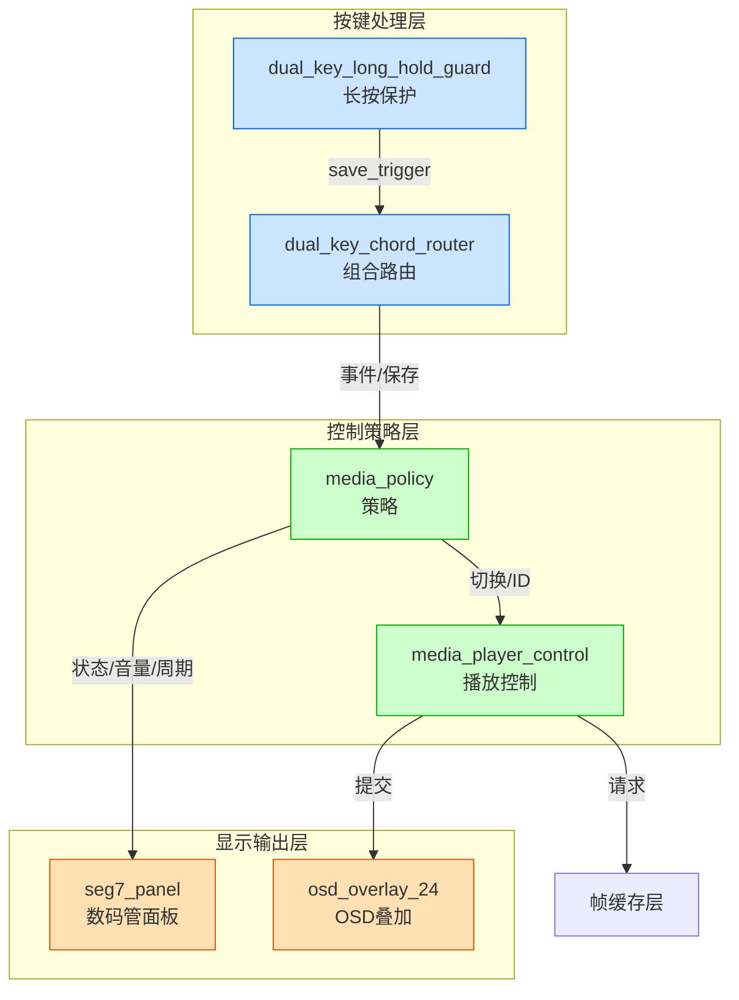

> **图注**：完赛工程控制架构3层——按键处理层（蓝：消抖+长按+组合键路由）、控制策略层（绿：策略决策+播放控制）、显示输出层（橙：数码管面板+OSD叠加）。关键：从all-in-one的sd_card_bmp拆分为3层6模块，每层职责单一。结论：分层架构让修改功能时只需改对应层，不影响其他层。

**完赛工程控制架构的特点：**

1. **按键处理独立成模块**：`dual_key_chord_router`支持单击、长按、组合键三种事件
   - KEY2单击 = 下一张
   - KEY3单击 = 自动轮播开关
   - KEY3长按0.5秒 = 亮度调节
   - KEY2+KEY3同时长按1秒 = 保存设置到Flash
   - 一个按键通过不同的按法可以触发不同功能，两个按键扩展出了5种以上的功能

2. **控制和策略分离**：
   - `media_policy`：策略层，决定"下一张切到哪张图"、"图片和音频怎么联动"
   - `media_player_control`：控制层，负责"什么时候发起加载请求"、"什么时候提交显示"、"轮播计时"
   - 策略和控制分离，改策略不用动控制逻辑，改控制不用动策略逻辑

3. **轮播周期运行时可配置**：
   - `media_player_control`有`period_cfg_valid`和`period_cfg_cycles`接口，可以在运行时通过UART或菜单修改轮播周期
   - 有范围检查：MIN_PERIOD_CYCLES=0.5秒，MAX_PERIOD_CYCLES=30秒，越界报错误码ERR_PERIOD_RANGE=0x51
   - 默认2.5秒（不是官方的1秒）

4. **帧边界提交**：
   - `media_player_control`有两个时钟域：sys_clk域（发起请求）和pix_clk域（提交显示）
   - 请求在sys_clk域发起，通过toggle握手同步到pix_clk域
   - 显示索引的提交**只在frame_start（帧起始，即VSYNC消隐期）时执行**，彻底杜绝撕裂
   - 提交后通过ack_toggle握手回sys_clk域，通知"请求已完成，可以发下一个请求"

5. **数码管面板三页面轮播**：
   - `seg7_panel`是8位数码管面板，不是官方的2位（或者4位）
   - 三个页面自动1秒轮播：PIC（图片编号）、VOL（音量0-255）、PRD（轮播周期秒数）
   - 参数变化时强制显示对应页面2秒（比如调音量时自动切到VOL页面）
   - 用双dabble算法做二进制到BCD的转换，显示十进制数字
   - 支持字母显示（P、I、C、V、O、L、R、D、S），不只是数字

6. **完整的错误码体系**：
   - ERR_NONE=0x00：无错误
   - ERR_PERIOD_RANGE=0x51：轮播周期越界
   - ERR_REQUEST_BUSY=0x52：请求忙（上一个请求还没完成就发新请求）
   - ERR_NO_RESOURCE=0x53：无可用资源（没有已完成的图片可切）
   - 错误码通过UART和OSD上报，方便调试

### 3.3 从官方到完赛的演进路径

**图2-11 从官方到完赛的演进路径图：**


> **图注**：控制架构演进7步——官方例程（all-in-one，短按×2+固定1秒+状态码）→第2课优化（最小改动，加上一张+可配置轮播+图片编号）→按键独立（dual_key_chord_router，单击/长按/组合键）→策略分离（media_policy+media_player_control，策略和控制解耦）→帧边界提交（pix_clk域frame_start提交，杜绝撕裂）→数码管升级（seg7_panel三页面轮播，PIC/VOL/PRD）→完赛工程（完整控制架构+错误码+可观测性+运行时配置）。结论：每一步都是最小改动渐进式演进，不是推倒重来。


**演进的核心思路：**
1. 先在官方基础上做最小改动（第2课），验证功能可行
2. 然后把按键处理独立出来，支持更多按键事件
3. 再把控制和策略分离，让架构更清晰
4. 然后优化提交时机（帧边界提交），提升稳定性
5. 最后升级显示输出（数码管面板、OSD），提升可观测性
6. 每一步都保证上板能跑，每一步都只改一部分

**为什么不一步到位直接写完赛工程？**
- 官方例程已经能跑，直接重写风险太大——写一半跑不起来，基础分都没了
- 渐进式演进每一步都能验证，出了问题容易回退
- 先拿满基础分，有底气了再冲高分，这是竞赛的稳妥策略

---

## 四、应用层最小改动的设计原则

这节课我们只改`sd_card_bmp.v`一个文件，这背后有几个重要的设计原则，以后做任何改动都应该遵循：

### 4.1 最小改动原则

**只改必要的部分，不重构、不重写。**
- 官方例程的核心状态机、双缓冲、跨时钟域同步都是经过验证的，不要动
- 我们只加三个功能，每个功能只加必要的寄存器和逻辑
- 能复用原有逻辑的就复用，比如上一张的加载启动逻辑和下一张几乎一样，只是图片编号计算不同

### 4.2 不破坏原有功能原则

**新增的功能和原有功能共存，不是替换。**
- 加上一张之后，下一张还要能用，自动轮播还要能用
- 改数码管显示之后，bmp_read的state_code还要能正常工作（只是不输出到数码管了）
- 改轮播周期之后，自动轮播的开关逻辑、计时逻辑都不变，只是计数上限变了

### 4.3 只改应用层原则

**绝对不碰底层驱动。**
- SDRAM控制器、HDMI发射器是加密IP，不能改
- `bmp_read`、`sd_card_top`、`frame_read_write`这些底层模块，这节课都不改
- 我们只改`sd_card_bmp.v`里的应用层逻辑——按键处理、状态机、显示控制
- 这样改出问题的概率最低，因为底层都是官方调好的

### 4.4 参数化设计原则

**能参数化的就参数化，不要写死。**
- 轮播周期用parameter，不要写死1秒
- 长按时间用parameter，不要写死1秒
- 图片数量官方已经用parameter了（SCAN_TARGET_COUNT），我们保持一致
- 参数化的好处：改一个数字就能调整行为，不用改代码逻辑，不容易引入bug

